# Luồng chung — Đồng bộ hóa đơn bán ra từ CQT để tạo đơn hàng

> Tài liệu này mô tả luồng nghiệp vụ tổng thể (BPMN) từ bước đồng bộ hóa đơn từ Cơ quan Thuế đến khi tạo đơn hàng hoàn thành trong EPOS.
>
> Chi tiết từng chức năng xem tại: [[docs/hoa-don-ban-ra/srs/spec.md|SRS-HDB-001]]

---

## Sơ đồ BPMN

```mermaid
flowchart TD
    START([🟢 Bắt đầu])

    subgraph SYNC["📥 Bước 1 — Đồng bộ từ CQT"]
        S1[Vào màn Danh sách HĐ bán ra]
        S2[Nhấn Đồng bộ\nChọn khoảng ngày]
        S3{Khoảng ngày\n≤ 30 ngày?}
        S3E[/Hiển thị lỗi\nkhoảng ngày/]
        S4[Gọi API CQT\nlấy HĐ bán ra]
        S5{API CQT\nthành công?}
        S5E([⛔ Ghi FAILED\nvào sync_history])
        S6{HĐ đã tồn tại\ntrong hệ thống?}
        S6Y[Bỏ qua HĐ trùng\nskip insert]
        S7[Lưu vào invoice_tax\ntypeInvoice = 1100]
        S8[Ghi sync_history\nstatus = SUCCESS]
        S9[/Hiển thị: Đồng bộ\nthành công X hóa đơn/]

        S1 --> S2 --> S3
        S3 -- ❌ Vượt 30 ngày --> S3E --> S2
        S3 -- ✅ Hợp lệ --> S4
        S4 --> S5
        S5 -- ❌ Lỗi --> S5E
        S5 -- ✅ Thành công --> S6
        S6 -- ✅ Đã có --> S6Y
        S6 -- ❌ Chưa có --> S7 --> S8 --> S9
    end

    subgraph LIST["📋 Bước 2 — Chọn hóa đơn"]
        L1[Xem danh sách HĐ bán ra\nLọc theo ngày / số HĐ / KH]
        L2[Nhấn Lập đơn\ntrên HĐ chọn]

        L1 --> L2
    end

    subgraph B1["🔗 B1 — Ghép cặp sản phẩm & khách hàng"]
        B1S1[Tự động ghép KH\nCusCode → KH nội bộ → Khách lẻ]
        B1S2[Tự động ghép SP\nTheo tên chuẩn hóa + ĐVT\ntừ invoice_product_mapping]
        B1S3[Xác định loại bill\nTHDon + đếm mức LTSuat]
        B1S4{Còn dòng SP\nchưa ghép?\nRow vàng}
        B1S5[Người dùng chọn SP EPOS\ncho dòng vàng thủ công]
        B1S6[Nhấn Xác nhận\n→ Mở màn bán hàng]
        B1S7[Lưu kết quả ghép\nvào invoice_product_mapping]

        B1S1 --> B1S2 --> B1S3 --> B1S4
        B1S4 -- Còn dòng vàng --> B1S5 --> B1S4
        B1S4 -- Tất cả đã ghép --> B1S6 --> B1S7
    end

    subgraph B2["🛒 B2 — Màn bán hàng"]
        B2S1[Mở màn bán hàng\nDữ liệu điền sẵn từ B1\n📅 Ngày = NLap từ XML HĐ thuế]
        B2S2{Cần chỉnh\nsửa đơn?}
        B2S3[Sửa SL / Giá / Ghi chú\nXóa dòng chiết khấu nếu cần]
        B2S4[Nhấn Thanh toán F9]
        B2S5[Chọn phương thức\nTiền mặt / Chuyển khoản / Thẻ]
        B2S6[Xác nhận thanh toán]
        B2S7[Tạo đơn hàng\ntrạng thái Hoàn thành\n🔑 Mã đơn EPOS tự sinh]
        B2S8[Trừ tồn kho\nCập nhật invoice_tax.ref_id]

        B2S1 --> B2S2
        B2S2 -- Có --> B2S3 --> B2S2
        B2S2 -- Không --> B2S4
        B2S4 --> B2S5 --> B2S6
        B2S6 --> B2S7 --> B2S8
    end

    END([🏁 Đơn hàng hoàn thành\nTồn kho đã trừ])

    START --> S1
    S9 --> L1
    L2 --> B1S1
    B1S7 --> B2S1
    B2S8 --> END
```



---

## Sequence Diagram — Đồng bộ thủ công hóa đơn bán ra (3.1)

```mermaid
sequenceDiagram
    actor User as Người dùng
    participant POS as Hệ thống POS
    participant Sync as Hệ thống đồng bộ thuế

    User->>POS: Nhấn "Đồng bộ"
    POS-->>User: Hiển thị popup Đồng bộ hóa đơn

    User->>POS: Chọn khoảng ngày + nhấn Đồng bộ

    alt Khoảng ngày > 30 ngày
        POS-->>User: Lỗi "Chỉ được đồng bộ tối đa 30 ngày"
    else Khoảng ngày hợp lệ
        POS->>Sync: Yêu cầu đồng bộ HĐ bán ra (fromDate, toDate)
        Note over Sync: Ghi sync_history status=PROCESSING

        Note over Sync: Gọi API CQT lấy HĐ bán ra

        alt API CQT lỗi
            Note over Sync: Ghi sync_history status=FAILED
            Sync-->>POS: Lỗi đồng bộ
            POS-->>User: "Đồng bộ thất bại. Vui lòng thử lại."
        else API CQT thành công
            loop Mỗi hóa đơn trong kết quả
                alt id_TCT đã tồn tại trong invoice_tax (typeInvoice=1100)
                    Note over Sync: Bỏ qua, không insert
                else Chưa tồn tại
                    Note over Sync: Đọc XML, tính bill_type<br/>(KHMSHDon=2 → Bán hàng;<br/>KHMSHDon=1 → đếm LTSuat → một/nhiều thuế)
                    Note over Sync: Xác định giảm trừ thuế<br/>TTKhac[DiscountVatRate] tồn tại & DLieu≠0<br/>→ chung: lưu rate+amount vào invoice_tax<br/>Ngược lại → riêng: rate=0, tổng per-product, lưu extra
                    Note over Sync: INSERT invoice_tax (typeInvoice=1100)<br/>INSERT invoice_product_tax (từng dòng SP)
                end
            end

            Note over Sync: Ghi sync_history status=SUCCESS
            Sync-->>POS: Đồng bộ thành công, count=X
            POS-->>User: "Đồng bộ thành công: X hóa đơn"
        end
    end
```

---

## Ghi chú nghiệp vụ quan trọng

| # | Điểm cần lưu ý | Chi tiết |
|---|---|---|
| 1 | **Ngày tạo đơn** | Lấy từ trường `NLap` (ngày lập HĐ) trong XML CQT — không phải ngày hôm nay |
| 2 | **Mã đơn hàng** | EPOS tự sinh — không lấy từ số HĐ thuế |
| 3 | **Trừ tồn kho** | Chỉ thực hiện khi đơn hàng chuyển sang trạng thái "Hoàn thành" (sau thanh toán) |
| 4 | **Combo/topping** | Không trigger popup chọn thành phần — nhập thẳng như sản phẩm đơn |
| 5 | **HĐ trùng** | So sánh `data.datas.id` với `invoice_tax.id_TCT` (cùng typeInvoice=1100) — bỏ qua nếu đã tồn tại |
| 6 | **Dòng chiết khấu** | `TChat=3` hiển thị màu tím ở B1 — người dùng có thể xóa trước khi xác nhận |
| 7 | **Lưu mapping** | Chỉ lưu các cặp ghép **thủ công** — cặp tự động khớp đã có trong `invoice_product_mapping` |
| 8 | **ref_id / ref_type** | Được cập nhật sau khi đơn hàng tạo thành công: `ref_type=1` (đơn hàng), `ref_id` = order ID |
