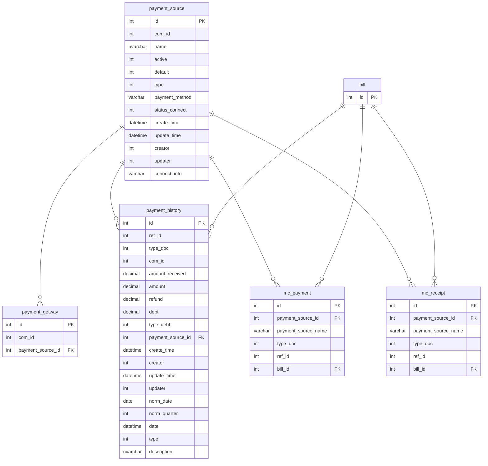

# SRS — Quản lý nguồn tiền (Phương thức và dịch vụ thanh toán)

**Mã tài liệu:** SRS-PSR-001  
**Phiên bản:** 1.0  
**Ngày tạo:** 2026-06-03  
**Người soạn:** Duong Thi Hue Linh (@huelinh)  
**Trạng thái:** Draft  

---

## LỊCH SỬ THAY ĐỔI TÀI LIỆU

> *A – Tạo mới, M – Sửa đổi, D – Xóa bỏ*

| Ngày thay đổi | Vị trí thay đổi | A/M/D | Nguồn gốc | Đầu mối | Mô tả thay đổi | Ghi chú |
|---|---|---|---|---|---|---|
| 2026-06-03 | Toàn bộ | A | Cải tiến hệ thống | @huelinh | Tạo mới tài liệu | |

---

## MỤC LỤC

1. Nguồn gốc thay đổi
2. Nội dung thay đổi
   - 2.1 Mô tả chung
   - 2.2 Luồng nghiệp vụ
   - 2.3 Yêu cầu người dùng
   - 2.4 Phạm vi và giải pháp
   - 2.5 Thay đổi CSDL
   - 2.6 Danh sách chức năng
3. Chi tiết các chức năng
4. Nghiệp vụ ảnh hưởng

---

## 1. NGUỒN GỐC THAY ĐỔI

### 1.1 Vấn đề hiện tại

Hệ thống EasyPOS hiện tại có những hạn chế sau trong quản lý thanh toán:

**Cấu hình cứng, không linh hoạt:** Hệ thống chỉ hỗ trợ đúng 3 phương thức thanh toán (PTTT) cố định khi bán hàng. Cửa hàng có nhiều tài khoản ngân hàng, nhiều ví điện tử không thể cấu hình thêm, buộc người dùng phải thao tác vòng vèo.

**Thông tin phân tán ở nhiều nơi:** Thông tin hình thức thanh toán hiện nằm ở 3 chỗ khác nhau:
- Thông tin HTTT ở cấu hình bán hàng
- Thông tin VietQR ở cấu hình thông tin cửa hàng (chỉ hỗ trợ 1 tài khoản)
- Cổng kết nối thanh toán ngân hàng (BIDV) ở cấu hình cổng thanh toán

Gây khó hiểu, mất thời gian tiếp cận cho người dùng mới.

**Không hỗ trợ thanh toán nhiều hình thức trong 1 lần:** Khi khách muốn trả một phần tiền mặt, một phần chuyển khoản, nhân viên phải thực hiện 3 thao tác riêng biệt: (1) thanh toán phần A, (2) tìm lại đơn hàng, (3) thanh toán tiếp phần B — gây mất thời gian và dễ sai sót.

### 1.2 Mong muốn

- Quản lý toàn bộ dòng tiền của cửa hàng tập trung tại một chức năng duy nhất
- Cho phép cửa hàng tự cấu hình PTTT theo nhu cầu thực tế, không giới hạn số lượng
- Cho phép khách hàng thanh toán nhiều PTTT trên cùng một đơn hàng (ver2)
- Phần hình thức thanh toán hiện tại chỉ còn đóng vai trò hiển thị và đẩy dữ liệu lên hóa đơn

---

## 2. NỘI DUNG THAY ĐỔI

### 2.1 Mô tả chung

Tính năng **Quản lý nguồn tiền** (hay Phương thức và dịch vụ thanh toán) cho phép quản lý cửa hàng cấu hình linh hoạt các hình thức nhận/trả tiền, tích hợp VietQR và cổng thanh toán ngân hàng vào một đầu mối duy nhất, đồng thời ghi nhận đầy đủ lịch sử dòng tiền ra/vào theo từng nguồn.

**Phạm vi triển khai:**

| Phiên bản | Nội dung |
|---|---|
| **Ver1** (tài liệu này) | Xây dựng chức năng Quản lý nguồn tiền; tích hợp VietQR và cổng TT; phân quyền; bán hàng chọn 1 nguồn tiền; báo cáo doanh thu theo nguồn tiền |
| **Ver2** (kế hoạch) | Cấu hình kết nối cổng TT nâng cao; thiết kế lại CSDL liên kết thu chi–đơn hàng–lịch sử TT; thanh toán nhiều PTTT trên 1 đơn; thu nợ, khoản thu khác |

**Phạm vi ảnh hưởng:**
- Cấu hình: thêm mục Phương thức và dịch vụ thanh toán
- Giao dịch: bán hàng, nhập kho, thu chi

### 2.2 Luồng nghiệp vụ

```
[Người dùng]                           [Hệ thống]
      |
      | (1) Cấu hình nguồn tiền
      |     (PTTT thông thường / Chuyển khoản / Cổng TT)
      |--------------------------------------> Lưu danh sách nguồn tiền
      |
      | (2) Thực hiện giao dịch
      |     (bán hàng / nhập kho / thu chi)
      |
      | (3) Chọn nguồn tiền + nhập số tiền
      |--------------------------------------> Ghi nhận giao dịch
      |                                        Tạo lịch sử thanh toán
      |                                        Tất toán chứng từ liên quan
      |
      |<-------------------------------------- Thống kê doanh thu
      |                                        theo từng nguồn tiền
```

### 2.3 Yêu cầu người dùng

| STT | Tác nhân | Tôi muốn... | Để... | Ưu tiên | FR |
|---|---|---|---|---|---|
| US-001 | Quản lý cửa hàng | Xem toàn bộ danh sách PTTT đã cấu hình, trạng thái hoạt động và kết nối | Có cái nhìn tổng quan, kịp thời phát hiện PTTT bị lỗi kết nối | Must Have | FR-003 |
| US-002 | Quản lý cửa hàng | Thêm mới PTTT loại Thông thường với tên tùy chỉnh | Linh hoạt cấu hình thêm hình thức nhận tiền theo nhu cầu | Must Have | FR-004 |
| US-003 | Quản lý cửa hàng | Thêm mới PTTT loại Chuyển khoản với thông tin ngân hàng | Hỗ trợ khách quét QR chuyển khoản, giảm dùng tiền mặt | Must Have | FR-004 |
| US-004 | Quản lý cửa hàng | Sửa thông tin PTTT đã tạo (tên, loại, thông tin NH) | Cập nhật khi thông tin NH thay đổi hoặc bật/tắt PTTT | Must Have | FR-006 |
| US-005 | Quản lý cửa hàng | Xóa PTTT không còn sử dụng | Dọn dẹp danh sách, tránh nhân viên chọn nhầm | Should Have | FR-007 |
| US-006 | Quản lý cửa hàng | Cài đặt PTTT hiển thị mặc định trong màn hình thanh toán | Giảm thao tác cho nhân viên, tăng tốc xác nhận đơn | Should Have | FR-008 |
| US-007 | Nhân viên bán hàng | Chọn nguồn tiền và nhập số tiền khi xác nhận thanh toán đơn hàng | Ghi nhận đúng nguồn tiền thu vào, phục vụ báo cáo dòng tiền | Must Have | FR-009 |
| US-008 | Nhân viên kho | Chọn nguồn tiền khi thanh toán phiếu nhập kho | Ghi nhận đúng nguồn tiền chi ra khi nhập hàng | Must Have | FR-010 |
| US-009 | Nhân viên thu ngân | Tạo phiếu thu với lựa chọn nguồn tiền cụ thể | Phân loại đúng dòng tiền thu vào theo từng PTTT | Must Have | FR-014 |
| US-010 | Nhân viên thu ngân | Sửa phiếu thu đã tạo (do chính mình tạo) | Điều chỉnh sai sót nhập liệu, giữ dòng tiền chính xác | Should Have | FR-015 |
| US-011 | Nhân viên thu ngân | Xóa phiếu thu không hợp lệ (do chính mình tạo) | Loại bỏ dữ liệu nhầm, tránh sai lệch báo cáo | Should Have | FR-016 |
| US-012 | Nhân viên thu ngân | Tạo phiếu chi với lựa chọn nguồn tiền cụ thể | Phân loại đúng dòng tiền chi ra theo từng PTTT | Must Have | FR-017 |
| US-013 | Nhân viên thu ngân | Sửa phiếu chi đã tạo (do chính mình tạo) | Điều chỉnh sai sót nhập liệu, giữ dòng tiền chính xác | Should Have | FR-018 |
| US-014 | Nhân viên thu ngân | Xóa phiếu chi không hợp lệ (do chính mình tạo) | Loại bỏ dữ liệu nhầm, tránh sai lệch báo cáo | Should Have | FR-019 |

### 2.4 Phạm vi và giải pháp

Tính năng này **thay thế** cách cấu hình cũ (HTTT trong cấu hình bán hàng + VietQR trong thông tin cửa hàng + BIDV trong cổng thanh toán) bằng một màn hình quản lý nguồn tiền tập trung.

**Không thuộc phạm vi ver1:**
- Thanh toán nhiều PTTT trên 1 đơn hàng (ver2)
- Cấu hình kết nối cổng thanh toán mới (ver2)

### 2.5 Thay đổi CSDL

#### 2.5.1 ERD



#### 2.5.2 Bảng `payment_source` — Mới hoàn toàn

| Tên cột | Kiểu | Mô tả |
|---|---|---|
| `id` | INT PK | Mã định danh tự sinh |
| `com_id` | INT | Mã công ty |
| `name` | NVARCHAR | Tên phương thức (vd: Tiền mặt, VietQR MB Bank) |
| `active` | INT | `1` — hoạt động; `0` — không hoạt động |
| `default` | INT | `1` — mặc định; `0` — không mặc định |
| `type` | INT | Loại nguồn tiền: `1` — Tiền mặt; `2` — Điểm; `3` — Thẻ KH (ví); `4` — Chuyển khoản; `5` — Cổng TT; `0` — Thông thường |
| `payment_method` | VARCHAR | Giá trị phương thức TT tự fill lên hóa đơn |
| `status_connect` | INT | `0` — chưa kết nối (PT thông thường, Chuyển khoản); `1` — kết nối thành công; `-1` — kết nối thất bại |
| `create_time` | DATETIME | Thời gian tạo |
| `update_time` | DATETIME | Thời gian cập nhật |
| `creator` | INT | ID user tạo |
| `updater` | INT | ID user cập nhật |
| `connect_info` | VARCHAR (JSON) | Thông tin kết nối VietQR: `{ bank_code, bank_account, bank_name, account_name, acqId }` |

> **Ghi chú type:** Type 1, 2, 3 là phương thức cơ bản, tự động tạo cho mọi công ty khi khởi tạo, **không cho phép xóa**.

#### 2.5.3 Bảng `payment_getway` — Bổ sung cột

| Tên cột | Kiểu | Mô tả |
|---|---|---|
| `payment_source_id` | INT FK | Liên kết sang `payment_source.id` |

#### 2.5.4 Bảng `payment_history` — Bổ sung / Sửa cột

| Tên cột | Kiểu | Thay đổi | Mô tả |
|---|---|---|---|
| `payment_method` | VARCHAR | **Bỏ** | Báo cáo HTTT theo hóa đơn lấy theo `bill`, không cần ở đây |
| `payment_source_id` | INT FK | **Thêm mới** | ID của nguồn tiền |
| `type` | INT | **Thêm mới** | `1` — Thu; `2` — Chi |
| `description` | NVARCHAR | **Thêm mới** | Diễn giải giao dịch (xem bảng quy tắc bên dưới) |

**Quy tắc sinh `description`:**

| Loại giao dịch | Giá trị `description` |
|---|---|
| Đơn hàng — thanh toán | "Thu bán hàng" |
| Đơn hàng — hủy | "Chi hủy hàng" |
| Đơn hàng — bị trả hàng (`bill.status=3`) | "Thu bán hàng" |
| Đơn hàng — trả hàng (`bill.status=4`) | "Chi trả hàng" |
| Đơn hàng — bị thay thế (`bill.status=5`) | "Chi trả thay thế" |
| Đơn hàng — thay thế (`bill.status=6`) | "Thu từ đơn thay thế" |
| Nhập hàng | "Chi nhập hàng" |
| Phiếu thu | "Thu + {tên khoản thu}" |
| Phiếu chi | "Chi + {tên khoản chi}" |

**Quy tắc gán giá trị `type`:**

| Điều kiện | Gán `type` |
|---|---|
| `type_doc = 3` (Nhập kho) | `2` — Chi |
| `bill.status = 5` (bị thay thế) và là bản ghi có `id` lớn nhất trong cùng `ref_id` | `2` — Chi |
| Tất cả trường hợp còn lại | `1` — Thu |

> Dùng `MAX(id)` thay vì `MAX(create_time)` để tránh trường hợp 2 bản ghi có `create_time` trùng nhau.

#### 2.5.5 Bảng `mc_payment` / `mc_receipt` — Bổ sung cột

| Tên cột | Kiểu | Mô tả |
|---|---|---|
| `payment_source_id` | INT FK | ID nguồn tiền |
| `payment_source_name` | NVARCHAR | Tên nguồn tiền (lưu snapshot để tránh mất dữ liệu khi đổi tên) |

**Bổ sung giá trị `type_doc`:**

| Giá trị | Ý nghĩa | `ref_id` |
|---|---|---|
| `0` | Giao dịch người dùng tạo tay | null |
| `1` | Đơn hàng | `bill.id` |
| `2` | Giao dịch kho | `rs_inoutward.id` |
| `3` | Nạp tiền *(thêm mới)* | null |
| `4` | Thu nợ gộp (khi xác nhận TT bán hàng, thu nợ KH) | null |

#### 2.5.6 Script migrate dữ liệu cũ

Thực hiện theo thứ tự:

**Bước 1 — Thêm PTTT mặc định cho tất cả công ty hiện tại**

> **Phân biệt theo loại hình kinh doanh:** Logic migrate Bước 1 khác nhau giữa loại hình thông thường và Gas/Xăng dầu (`business_type = 4`).

---

**Bước 1A — Các loại hình kinh doanh thông thường (không phải Gas/Xăng dầu)**

Với mỗi công ty, tự động tạo 3 bản ghi cơ bản:

| Tên | `type` | `active` | `default` |
|---|---|---|---|
| Tiền mặt | 1 | 1 | 1 |
| Điểm | 2 | 1 | 0 |
| Thẻ khách hàng | 3 | 1 | 0 |

Với công ty đang có cấu hình VietQR (`company.bank_account NOT NULL`): tạo thêm bản ghi `type=4`, `connect_info` lấy từ `company.{bank_account, bank_name, account_name, acqId}`, đồng thời cập nhật `payment_getway.payment_source_id`.

Với công ty đang có cổng thanh toán (`payment_gateway.status=1`): tạo bản ghi `type=5`, `status_connect=1`, cập nhật `payment_gateway.payment_source_id`.

Lấy thêm DS PTTT từ `config.code = 'payment_method'` và lịch sử cũ (`DISTINCT bill.payment_method`, `mc_payment.payment_method`, `mc_receipt.payment_method`), loại bỏ trùng tên, thêm vào `payment_source` với `type=0`.

---

**Bước 1B — Gas/Xăng dầu (`business_type = 4`) — migrate riêng**

Gas không dùng Cổng thanh toán. Toàn bộ nguồn tiền đều có `type=0` (cơ bản).

**Bước B1 — Lấy DS từ `config.code = 'payment_method'`:**

Với mỗi công ty gas, lấy tất cả bản ghi `config` có `code = 'payment_method'` trong cùng `com_id` → tạo `payment_source` tương ứng:

| Trường | Giá trị |
|---|---|
| `name` | `config.value` (tên PTTT) |
| `type` | `0` (cơ bản) |
| `active` | `1` (hoạt động) |
| `com_id` | Theo công ty |

**Bước B2 — Sweep lịch sử giao dịch cũ:**

Lấy `DISTINCT` của:
- `bill.payment_method`
- `mc_payment.payment_method`
- `mc_receipt.payment_method`
- `payment_history.payment_method`

Trong phạm vi cùng `com_id`. So sánh (không phân biệt hoa thường, không phân biệt dấu) với các `payment_source.name` đã tạo ở Bước B1:

| Trường hợp | Xử lý |
|---|---|
| Đã trùng tên với bản ghi B1 cùng `com_id` | Bỏ qua, không tạo thêm |
| Chưa trùng | Tạo `payment_source` mới: `type=0`, `active=0` (không hoạt động) |

**Bước 2 — Thêm bản ghi `payment_history` còn thiếu**

Với đơn hủy hàng (`bill.status=2`): tạo 1 bản ghi loại chi hoàn tiền (số tiền = tổng `payment_history.amount` đã thu của đơn).

**Bước 3 — Update thông tin phiếu thu chi**

Định nghĩa lại nguồn tiền của các phiếu thu chi hiện tại.

> **Lưu ý:** Các bản ghi không có `payment_method` sẽ không thể update `payment_source_id`.

**(1) Thêm trường vào các bảng:**

| Bảng | Trường thêm mới |
|---|---|
| `mc_payment` | `payment_source_id` (INT FK), `payment_source_name` (NVARCHAR) |
| `mc_receipt` | `payment_source_id` (INT FK), `payment_source_name` (NVARCHAR) |
| `payment_history` | `payment_source_id` (INT FK) |

**(2) Update `mc_payment` / `mc_receipt`:**

Điều kiện: `payment_source.name = mc_payment/mc_receipt.payment_method` trong cùng `com_id`.

```sql
UPDATE mc_payment t
JOIN payment_source ps
  ON ps.com_id = t.com_id
 AND LOWER(TRIM(ps.name)) = LOWER(TRIM(t.payment_method))
SET t.payment_source_id = ps.id,
    t.payment_source_name = ps.name
WHERE t.payment_source_id IS NULL
```

*(Chạy tương tự cho `mc_receipt`)*

**(3) Update `payment_history`:**

Điều kiện: `payment_history.payment_method = mc_payment/mc_receipt.payment_method = payment_source.name` trong cùng `com_id`.

```sql
UPDATE payment_history t
JOIN payment_source ps
  ON ps.com_id = t.com_id
 AND LOWER(TRIM(ps.name)) = LOWER(TRIM(t.payment_method))
SET t.payment_source_id = ps.id
WHERE t.payment_source_id IS NULL
```

**Bước 3.5 — Fix `mc_receipt.type_doc` cho dữ liệu cũ**

Hiện tại DB dev đang để `type_doc = 1` cho toàn bộ phiếu thu, kể cả giao dịch ND tạo tay. Cần phân loại lại đúng.

**Bước A:** Records có `type_desc = N'Phiếu thu nạp tiền'` → `type_doc = 3`

```sql
UPDATE mc_receipt
SET type_doc = 3
WHERE type_desc = N'Phiếu thu nạp tiền'
```

**Bước B:** Records có `type_doc = 1` nhưng `ref_id IS NULL` → đây là giao dịch ND tạo tay bị gán sai, chuyển về `type_doc = 0`

```sql
UPDATE mc_receipt
SET type_doc = 0
WHERE type_doc = 1
  AND ref_id IS NULL
```

> **Lưu ý:** Chạy Bước A trước Bước B. Records `type_doc = 1` có `ref_id IS NOT NULL` là đơn hàng thực — giữ nguyên.

**Bước 4 — Cập nhật `payment_history.type` cho dữ liệu cũ**

**4a — Nhập kho (`type_doc = 3`):**
Toàn bộ bản ghi có `type_doc = 3` → gán `type = 2` (Chi).

**4b — Bị thay thế (`bill.status = 5`):**
Với mỗi `ref_id` thuộc nhóm bill có `status = 5`, tìm bản ghi có `id` lớn nhất trong cùng `ref_id` đó → gán `type = 2` (Chi).
Join: `payment_history.ref_id = bill.id`, điều kiện `bill.status = 5`.
Các bản ghi còn lại trong cùng `ref_id` → gán `type = 1` (Thu).

**4c — Fallback:**
Toàn bộ bản ghi còn lại chưa được gán `type` → gán `type = 1` (Thu).

### 2.6 Danh sách chức năng

| STT | Mã FR | Tên chức năng | Nhóm |
|---|---|---|---|
| 1 | FR-payment-source-001 | Tự động khởi tạo bộ PTTT mặc định khi tạo mới công ty | Cấu hình |
| 2 | FR-payment-source-002 | Xóa thông tin VietQR khỏi cấu hình thông tin cửa hàng | Cấu hình |
| 3 | FR-payment-source-003 | Xem danh sách phương thức và dịch vụ thanh toán | Cấu hình |
| 4 | FR-payment-source-004 | Thêm mới phương thức thanh toán | Cấu hình |
| 5 | FR-payment-source-005 | Xem chi tiết phương thức thanh toán | Cấu hình |
| 6 | FR-payment-source-006 | Sửa phương thức thanh toán | Cấu hình |
| 7 | FR-payment-source-007 | Xóa phương thức thanh toán | Cấu hình |
| 8 | FR-payment-source-008 | Cài đặt phương thức mặc định | Cấu hình |
| 9 | FR-payment-source-009 | Bán hàng — chọn nguồn tiền khi thanh toán | Giao dịch |
| 10 | FR-payment-source-010 | Nhập kho — chọn nguồn tiền khi thanh toán | Giao dịch |
| 11 | FR-payment-source-011 | Sửa phiếu nhập kho — cập nhật nguồn tiền | Giao dịch |
| 12 | FR-payment-source-012 | Hủy đơn hàng — tự động tạo lịch sử TT hoàn tiền | Giao dịch |
| 13 | FR-payment-source-013 | Xem danh sách phiếu thu chi (cập nhật hiển thị nút Sửa) | Giao dịch |
| 14 | FR-payment-source-014 | Thêm khoản thu | Giao dịch |
| 15 | FR-payment-source-015 | Sửa khoản thu | Giao dịch |
| 16 | FR-payment-source-016 | Xóa khoản thu | Giao dịch |
| 17 | FR-payment-source-017 | Thêm khoản chi | Giao dịch |
| 18 | FR-payment-source-018 | Sửa khoản chi | Giao dịch |
| 19 | FR-payment-source-019 | Xóa khoản chi | Giao dịch |
| 20 | FR-payment-source-020 | Báo cáo lưu chuyển tiền theo PTTT *(tạm thời chưa triển khai)* | Báo cáo |
| 21 | FR-payment-source-021 | Import đơn hàng từ Excel — cập nhật xử lý nguồn tiền | Giao dịch |

---

## 3. CHI TIẾT CÁC CHỨC NĂNG

### FR-payment-source-001 — Tự động khởi tạo bộ PTTT mặc định khi tạo mới công ty

| Mục | Nội dung |
|---|---|
| **Mục đích** | Đảm bảo mọi công ty mới đều có sẵn bộ PTTT cơ bản ngay sau khi khởi tạo |
| **Kích hoạt** | Hệ thống tự động kích hoạt khi có công ty mới được tạo |
| **Tiền điều kiện** | N/A |
| **Hậu điều kiện** | Công ty mới có 2 PTTT mặc định: Tiền mặt (`default=1`), Chuyển khoản (`default=0`) |
| **Quy tắc NV** | Tất cả công ty đều có bộ PTTT mặc định: Tiền mặt và Chuyển khoản |

**Logic xử lý BE (bổ sung):**

Khi tạo mới 1 công ty, hệ thống tự động sinh bộ mẫu mặc định vào `payment_source`:

| Tên | `type` | `active` | `default` |
|---|---|---|---|
| Tiền mặt | 1 | 1 | 1 |
| Chuyển khoản | 0 | 1 | 0 |

---

### FR-payment-source-002 — Xóa thông tin VietQR khỏi cấu hình thông tin cửa hàng

| Mục | Nội dung |
|---|---|
| **Mục đích** | Tập trung quản lý VietQR về chức năng Nguồn tiền, loại bỏ cấu hình trùng lặp |
| **Màn hình ảnh hưởng** | Cài đặt > Cấu hình cửa hàng > Thông tin cửa hàng |

**Thay đổi màn hình:** Xóa bỏ các trường sau:
- Ngân hàng
- Tên ngân hàng hiển thị
- Số tài khoản
- Tên người hưởng thụ

**API ảnh hưởng:** `update-company-info`

---

### FR-payment-source-003 — Xem danh sách phương thức và dịch vụ thanh toán

| Mục | Nội dung |
|---|---|
| **Mục đích** | Xem toàn bộ PTTT đã cấu hình của cửa hàng |
| **Kích hoạt** | Người dùng chọn Cài đặt cửa hàng > Phương thức và dịch vụ thanh toán |
| **Tiền điều kiện** | Đã đăng nhập; có quyền thao tác |
| **Hậu điều kiện** | Màn hình hiển thị danh sách PTTT |
| **Quy tắc NV** | N/A |

**Bố cục màn hình:**

Màn hình "Phương thức thanh toán" gồm 3 vùng xếp dọc trên cùng một trang:

```
┌─────────────────────────────────────────────────────────────────┐
│  Cổng thanh toán điện tử                                        │
│  [Logo] Ngân hàng Thương mại CP Ngoại thương VN   [ Kết nối ]  │
│  [Logo] Ngân hàng Thương mại CP Kỹ Thương VN      [ Kết nối ]  │
│  [Logo] Ngân hàng Thương mại CP ĐT&PT VN          [ Kết nối ]  │
├─────────────────────────────────────────────────────────────────┤
│  Danh sách phương thức thanh toán        [+ Thêm mới]          │
│  [ 🔍  Nhập tên thẻ                ]                            │
│  STT │ Tên phương thức │ Phân loại │ TT hoạt động │ TT kết nối │ Thao tác │
│   1  │ abc             │ Thông thường│ Đang hoạt động│ Thành công │ ✏️ 🗑️   │
│   …  │ …               │ …         │ …             │ …          │ …        │
│  [ 15 bản ghi ▾ ]    ‹  1  2  3  …  4  5  ›                   │
├─────────────────────────────────────────────────────────────────┤
│  Cài đặt phương thức thanh toán mặc định                       │
│  Phương thức được ưu tiên dùng khi xác nhận thanh toán đơn hàng│
│  Phương thức mặc định   [ Tiền mặt                          ▾ ]│
└─────────────────────────────────────────────────────────────────┘
```

**Vùng 1 — Cổng thanh toán điện tử:**

| Tên trường | Loại control | Mô tả |
|---|---|---|
| Logo ngân hàng | Image | Logo hiển thị kèm tên đầy đủ của ngân hàng |
| Tên ngân hàng | Text | Tên đầy đủ ngân hàng hỗ trợ kết nối cổng TT |
| Kết nối | Button | Click: mở luồng cấu hình kết nối cổng thanh toán của ngân hàng tương ứng |

> Vùng này hiển thị danh sách các ngân hàng hệ thống hỗ trợ tích hợp cổng TT (Vietcombank, Techcombank, BIDV,...). Trạng thái nút "Kết nối" thay đổi khi đã kết nối thành công.

**Logic xử lý khi click "Kết nối" (Vùng 1):**

1. Hiển thị popup giao diện cổng thanh toán điện tử (giữ nguyên luồng cũ)
2. Người dùng nhập thông tin, bấm kết nối
3. Ngân hàng trả về `payment_gateway.status`:
   - `status = 1` hoặc `4` → kết nối thành công:
     - Chưa có `payment_source` cho ngân hàng này → tạo mới (`type=5`, `status_connect=1`)
     - Đã có `payment_source` rồi → chỉ cập nhật `status_connect=1`, **không tạo thêm bản ghi**
   - `status` khác → không tạo / không thay đổi `payment_source`

**Vùng 2 — Danh sách phương thức thanh toán:**

| Tên trường | Loại control | Mô tả |
|---|---|---|
| Tìm kiếm | Textbox | Placeholder: "Nhập tên thẻ"; lọc danh sách theo tên PTTT khi nhập |
| Thêm mới | Button (góc phải) | Click: mở màn hình thêm mới PTTT |
| STT | Text | Đánh số thứ tự |
| Tên phương thức | Text | Tên PTTT |
| Phân loại | Text | Thông thường / Chuyển khoản / Cổng thanh toán |
| Trạng thái hoạt động | Text (màu) | **Đang hoạt động** (chữ xanh) / **Ngưng hoạt động** (chữ đỏ) |
| Trạng thái kết nối | Text | Chưa kết nối / Thành công / Thất bại |
| Thao tác — Sửa | Icon Button (✏️) | Click: mở màn hình sửa PTTT |
| Thao tác — Xóa | Icon Button (🗑️) | Click: hiển thị popup xác nhận xóa |
| Số bản ghi/trang | Dropdown (góc trái) | Giá trị mặc định: 15 bản ghi; cho phép chọn lại |
| Phân trang | Pager | Hiển thị số trang; nút ‹ / › để chuyển trang |

**Vùng 3 — Cài đặt phương thức thanh toán mặc định:**

> Vùng này hiển thị **inline** ở cuối trang, không phải màn hình riêng. Thay đổi ở đây tương đương với FR-payment-source-008.

| Tên trường | Loại control | Mô tả |
|---|---|---|
| Tiêu đề phụ | Text (mô tả) | "Phương thức thanh toán được ưu tiên sử dụng khi xác nhận thanh toán đơn hàng" |
| Phương thức mặc định | Combo-box | DS các PTTT đang hoạt động; cho phép chọn 1; lưu ngay khi chọn hoặc qua nút Lưu |

---

### FR-payment-source-004 — Thêm mới phương thức thanh toán

| Mục | Nội dung |
|---|---|
| **Mục đích** | Thêm PTTT mới phục vụ thanh toán |
| **Kích hoạt** | Người dùng click Thêm mới |
| **Tiền điều kiện** | Đã đăng nhập; có quyền thao tác |
| **Hậu điều kiện** | Hệ thống lưu PTTT mới; hiển thị thông báo thành công; PTTT mới có thể dùng trong bán hàng |
| **Quy tắc NV** | (1) Cho phép cấu hình loại Thông thường hoặc Chuyển khoản; (2) Loại Chuyển khoản yêu cầu nhập đầy đủ thông tin ngân hàng trước khi lưu; (3) Tên không được trùng với PTTT đã tồn tại |

**Luồng thao tác:**
1. Người dùng click Thêm mới
2. Hệ thống hiển thị màn hình thêm mới
3. Người dùng nhập thông tin, click Lưu
4. Hệ thống hiển thị thông báo thành công

**Màn hình — Modal popup "Thêm phương thức thanh toán":**

Form hiển thị dạng modal (có nút X đóng). Nội dung form thay đổi tùy theo **Loại phương thức TT** được chọn.

---

**Trạng thái 1 — Loại Thông thường:**

```
┌─────────────────────────────────────────────────┐
│  Thêm phương thức thanh toán               [X]  │
├─────────────────────────────────────────────────┤
│  Loại phương thức TT *  [ Chọn loại phương thức ▾ ] │
│  Tên phương thức *      [ Nhập...               ] │
│  ☐ Kích hoạt phương thức                        │
│                         [ Hủy bỏ ]  [ Lưu ]    │
└─────────────────────────────────────────────────┘
```

| Tên trường | Loại control | Bắt buộc | Mô tả |
|---|---|---|---|
| Loại phương thức TT | Combo-box | Y | Placeholder: "Chọn loại phương thức"; giá trị: Thông thường / Chuyển khoản |
| Tên phương thức | Textbox | Y | Placeholder: "Nhập..."; không được trùng tên đã tồn tại |
| Kích hoạt phương thức | Checkbox | — | Tích = kích hoạt PTTT; không tích = tắt; mặc định: đã tích |
| Hủy bỏ | Button | — | Đóng modal, không lưu |
| Lưu | Button | — | Lưu thông tin; hiển thị thông báo thành công |

---

**Trạng thái 2 — Loại Chuyển khoản:**

```
┌─────────────────────────────────────────────────┐
│  Thêm phương thức thanh toán               [X]  │
├─────────────────────────────────────────────────┤
│  Loại phương thức TT *  [ Chọn loại phương thức ▾ ] │
│  Tên phương thức *      [ Nhập...               ] │
│  Ngân hàng *            [ Chọn ngân hàng      ▾ ] │
│  Tên ngân hàng hiển thị *  [ Nhập...           ] │
│  Số tài khoản *         [ Nhập...               ] │
│  Tên người hưởng thụ *  [ Nhập...               ] │
│                         [ Hủy bỏ ]  [ Lưu ]    │
└─────────────────────────────────────────────────┘
```

| Tên trường | Loại control | Bắt buộc | Mô tả |
|---|---|---|---|
| Loại phương thức TT | Combo-box | Y | Đã chọn Chuyển khoản |
| Tên phương thức | Textbox | Y | Placeholder: "Nhập..."; không được trùng tên đã tồn tại |
| Ngân hàng | Combo-box | Y | Placeholder: "Chọn ngân hàng"; giá trị lấy từ API `get-vietQR-bank` |
| Tên ngân hàng hiển thị | Textbox | Y | **Tự động fill** khi người dùng chọn ngân hàng; người dùng **được phép chỉnh sửa lại** sau khi auto-fill |
| Số tài khoản | Textbox | Y | Placeholder: "Nhập..." |
| Tên người hưởng thụ | Textbox | Y | Placeholder: "Nhập..." |
| Hủy bỏ | Button | — | Đóng modal, không lưu |
| Lưu | Button | — | Lưu thông tin; hiển thị thông báo thành công |

> **Lưu ý:** Khi chọn loại Chuyển khoản, checkbox "Kích hoạt phương thức" không hiển thị.

---

### FR-payment-source-005 — Xem chi tiết phương thức thanh toán

| Mục | Nội dung |
|---|---|
| **Mục đích** | Xem thông tin chi tiết của 1 PTTT |
| **Kích hoạt** | Người dùng click vào 1 dòng trong danh sách |
| **Tiền điều kiện** | Đã đăng nhập; có quyền thao tác |
| **Hậu điều kiện** | Màn hình chi tiết PTTT được hiển thị |
| **Quy tắc NV** | N/A |

**Luồng thao tác:**
1. Người dùng click 1 dòng phương thức
2. Hệ thống hiển thị màn hình xem chi tiết

**Màn hình — Chi tiết PTTT:**

| Tên trường | Loại control | Mô tả |
|---|---|---|
| Tên phương thức | Text | Tên PTTT |
| Trạng thái hoạt động | Text | Trạng thái |
| Phân loại | Text | Phân loại |
| **Hiển thị thêm khi phân loại Chuyển khoản:** | | |
| Ngân hàng | Text | Ngân hàng |
| Tên ngân hàng | Text | Tên ngân hàng |
| Số tài khoản | Text | Số tài khoản |
| Tên người thụ hưởng | Text | Tên người thụ hưởng |
| Sửa | Button | Mở màn hình sửa |
| Hủy bỏ | Button | Trở về màn hình trước |

---

### FR-payment-source-006 — Sửa phương thức thanh toán

| Mục | Nội dung |
|---|---|
| **Mục đích** | Cập nhật thông tin PTTT |
| **Kích hoạt** | Người dùng click Sửa |
| **Tiền điều kiện** | Đã đăng nhập; có quyền thao tác |
| **Hậu điều kiện** | Hệ thống cập nhật thông tin; hiển thị thông báo thành công |
| **Quy tắc NV** | (1) Cho phép đổi loại Thông thường ↔ Chuyển khoản; (2) Loại Chuyển khoản yêu cầu đầy đủ thông tin NH; (3) Tên không được trùng PTTT đã tồn tại |

**Luồng thao tác:**
1. Người dùng click Sửa
2. Hệ thống hiển thị form sửa với dữ liệu hiện tại
3. Người dùng điều chỉnh thông tin, click Lưu
4. Hệ thống hiển thị thông báo thành công, trở về danh sách

**Màn hình — Form sửa:** *(tương tự màn hình thêm mới, dữ liệu được điền sẵn)*

| Tên trường | Loại control | Bắt buộc | Mô tả |
|---|---|---|---|
| Tên phương thức | Textbox | Y | Không được trùng tên đã tồn tại |
| Trạng thái hoạt động | Toggle/Radio | Y | Hoạt động / Không hoạt động; cho phép chọn lại |
| Phân loại | Radio | — | Thông thường / Chuyển khoản; cho phép chọn lại |
| Ngân hàng | Combo-box | Y* | DS ngân hàng |
| Tên ngân hàng | Text | Y* | Tự fill theo ngân hàng chọn |
| Số tài khoản | Textbox | Y* | Cho phép nhập |
| Tên người thụ hưởng | Textbox | Y* | Cho phép nhập |
| Lưu | Button | — | Lưu; hiển thị thông báo thành công; về danh sách |
| Hủy bỏ | Button | — | Trở về màn hình trước |

---

### FR-payment-source-007 — Xóa phương thức thanh toán

| Mục | Nội dung |
|---|---|
| **Mục đích** | Xóa PTTT không còn sử dụng hoặc tạo nhầm |
| **Kích hoạt** | Người dùng click Xóa |
| **Tiền điều kiện** | Đã đăng nhập; có quyền thao tác |
| **Hậu điều kiện** | Hệ thống xóa PTTT; hiển thị thông báo thành công |
| **Quy tắc NV** | (1) **Chỉ cho phép xóa PTTT chưa có lịch sử giao dịch**; (2) Yêu cầu xác nhận trước khi xóa |

**Luồng thao tác:**
1. Người dùng click Xóa
2. Hệ thống hiển thị popup xác nhận
3. Người dùng click Xác nhận xóa
4. Hệ thống thực hiện xóa, hiển thị thông báo thành công

**Màn hình — Popup xác nhận:**

| Tên trường | Loại control | Mô tả |
|---|---|---|
| Thông báo | Text | "Bạn có chắc chắn muốn xóa phương thức và dịch vụ thanh toán này?" |
| Xóa | Button | Thực hiện xóa; hiển thị thông báo thành công; về màn hình trước |
| Hủy bỏ | Button | Đóng popup; giữ nguyên |

**Logic xử lý:**
- Kiểm tra `payment_history` có bản ghi nào với `payment_source_id` tương ứng không
- Nếu có: hiển thị lỗi *"Phương thức [tên] đã được sử dụng. Bạn không thể xóa."*
- Nếu không: thực hiện xóa

**API:** Đầu vào: `id` phương thức; Đầu ra: thông báo thành công/thất bại + mô tả

---

### FR-payment-source-008 — Cài đặt phương thức mặc định

| Mục | Nội dung |
|---|---|
| **Mục đích** | Cài đặt PTTT mặc định hiển thị sẵn khi bán hàng |
| **Kích hoạt** | Người dùng click Cài đặt mặc định |
| **Tiền điều kiện** | Đã đăng nhập; có quyền thao tác |
| **Hậu điều kiện** | Hệ thống cập nhật PTTT mặc định thành công |
| **Quy tắc NV** | Có thể cài mặc định 1 PTTT hoặc không có PTTT mặc định |

**Luồng thao tác:**
1. Người dùng click Cài đặt mặc định
2. Hệ thống hiển thị màn hình cài đặt
3. Người dùng điều chỉnh, click Lưu
4. Hệ thống hiển thị thông báo thành công

**Màn hình:**

| Tên trường | Loại control | Bắt buộc | Mô tả |
|---|---|---|---|
| Cài đặt phương thức mặc định | Radio-button | Y | Có / Không |
| Phương thức mặc định | Combo-box | Y | DS các nguồn tiền; cho phép chọn 1; chỉ hiển thị khi chọn "Có" |

**Logic xử lý:**
- Chọn **Có**: cập nhật PTTT được chọn `default=1`, tất cả PTTT còn lại `default=0`
- Chọn **Không**: tất cả PTTT `default=0`

---

### FR-payment-source-009 — Bán hàng — chọn nguồn tiền khi thanh toán

| Mục | Nội dung |
|---|---|
| **Mục đích** | Ghi nhận đúng nguồn tiền thu vào khi xác nhận thanh toán đơn hàng |
| **Kích hoạt** | Người dùng click Thanh toán trong màn hình bán hàng |
| **Tiền điều kiện** | N/A |
| **Hậu điều kiện** | Đơn hàng được tạo thành công với nguồn tiền tương ứng; lịch sử thanh toán được ghi nhận |
| **Quy tắc NV** | (1) Bắt buộc chọn PTTT và nhập số tiền trước khi xác nhận; (2) Chỉ hiển thị PTTT đang hoạt động và đã kết nối thành công (với Chuyển khoản/Cổng TT); (3) Phân biệt PTTT (nguồn tiền) với hình thức TT trên hóa đơn |

**Phân biệt Nguồn tiền và Hình thức TT hóa đơn:**

Màn hình Xác nhận thanh toán có 2 trường liên quan đến thanh toán nhưng phục vụ mục đích khác nhau:

| | Nguồn tiền (PTTT) | Hình thức TT hóa đơn |
|---|---|---|
| **Field DB** | `payment_history.payment_source_id` | `bill.payment_method` |
| **Câu hỏi** | Tiền thu vào kết/tài khoản nào? | Khách thanh toán bằng cách nào? |
| **Danh sách** | Do cửa hàng cấu hình (feature này) | Cố định 5 loại: Tiền mặt / Chuyển khoản / TM/CK / Cổng TT / Khác |
| **Mục đích** | Theo dõi dòng tiền, báo cáo cash flow | In trên hóa đơn, báo cáo doanh thu theo HTTT |
| **UI** | Dropdown — feature mới | Radio buttons — giữ nguyên |

> Hai trường độc lập: chọn một không ảnh hưởng đến cái kia.
>
> **Ví dụ:** Khách chuyển khoản vào TK Vietcombank của cửa hàng → `bill.payment_method = "Chuyển khoản"` (HTTT hóa đơn), `payment_source_id = [ID nguồn "Vietcombank"]` (nguồn tiền).

**Luồng thao tác:**
1. Người dùng bán hàng, click Thanh toán
2. Hệ thống hiển thị màn hình Xác nhận thanh toán
3. Người dùng chọn PTTT, nhập số tiền
4. Hệ thống hiển thị thông báo thành công

**Luồng hệ thống:**

- Trường **Phương thức TT** (nguồn tiền) → Lưu `payment_history.payment_source_id` / `mc_receipt.payment_source_id`
- Trường **Phương thức TT hóa đơn** → Lưu `bill.payment_method` / `invoice.payment_method`

**Thay đổi màn hình Xác nhận thanh toán:**
- **Bỏ:** trường "Phương thức thanh toán hóa đơn" (thay bằng "Hình thức TT" đẩy lên HĐ)
- **Thêm:** trường "Phương thức TT" — radio button theo loại
- **Thay đổi luồng QR:** QR không hiển thị ngay khi chọn PTTT mà hiển thị sau khi bấm nút "Thanh toán"

**Màn hình Xác nhận thanh toán:**

| Tên trường | Loại control | Mô tả |
|---|---|---|
| Phương thức TT | Radio button (theo loại) | Các tuỳ chọn: Tiền mặt / Chuyển khoản / Cổng thanh toán / Thông thường / ···; chọn 1; mặc định = PTTT mặc định (nếu có) |
| Tài khoản ngân hàng | Combo-box *(hiện khi chọn Chuyển khoản)* | DS tài khoản `type=4, active=1`; mặc định = tài khoản mặc định; cuối DS có dòng "Thêm phương thức thanh toán" |
| Cổng thanh toán | Combo-box *(hiện khi chọn Cổng thanh toán)* | DS cổng TT `type=5, active=1, status_connect=1`; cuối DS có dòng "Thêm cổng thanh toán" |
| Phương thức thông thường | Combo-box *(hiện khi chọn Thông thường)* | DS PTTT `type=0, active=1`; cuối DS có dòng "Thêm phương thức thanh toán" |
| Phương thức TT hóa đơn | Dropdown | Danh sách cố định: Tiền mặt / Chuyển khoản / TM/CK / Cổng TT / Khác; lưu vào `bill.payment_method` |
| Khách trả | Textbox (số) | Số tiền khách đưa; mặc định = tổng tiền cần TT |
| Tiền thừa | Text (read-only) | Khách trả − Tổng tiền; hiển thị 0 nếu âm |
| Chi tiết thanh toán | Collapsible section | Tạm tính / chiết khấu / khuyến mại / phụ thu / thuế / tổng cần TT |
| Hủy bỏ | Button (secondary) | Đóng modal, không lưu |
| Thanh toán | Button (primary) | Xác nhận TT; nếu loại Chuyển khoản hoặc Cổng TT → mở màn hình QR fullscreen trước khi tạo đơn |

> Combo-box tài khoản/cổng TT/thông thường mặc định đóng; click trigger để xổ danh sách.

**Màn hình QR fullscreen** *(hiển thị sau khi bấm "Thanh toán" với loại Chuyển khoản hoặc Cổng TT):*

| Tên trường | Loại control | Mô tả |
|---|---|---|
| Logo VietQR + mã QR | Canvas | QR sinh theo tài khoản được chọn trong combobox |
| Số tiền | Text | Tổng tiền cần thanh toán |
| Nội dung chuyển khoản | Text | Nội dung mặc định của đơn hàng |
| Tên chủ tài khoản | Text | Theo thông tin tài khoản đã chọn |
| Số tài khoản | Text | Theo thông tin tài khoản đã chọn |
| Hủy bỏ | Button | Đóng QR, trở về màn hình Xác nhận thanh toán |
| Xác nhận | Button | Xác nhận TT thành công; tạo đơn hàng; về màn hình bán hàng |

**API ảnh hưởng:**
- Lấy DS PTTT: `get-payment-source`
- Xác nhận thanh toán: `api/client/page/bill/done-by-id`
- Tạo đơn hàng: `api/client/page/bill/create`

---

### FR-payment-source-010 — Nhập kho — chọn nguồn tiền khi thanh toán

| Mục | Nội dung |
|---|---|
| **Mục đích** | Ghi nhận đúng nguồn tiền chi ra khi thanh toán nhập kho |
| **Kích hoạt** | Người dùng click Thanh toán trong màn hình nhập kho |
| **Tiền điều kiện** | N/A |
| **Hậu điều kiện** | Phiếu nhập kho được tạo với nguồn tiền tương ứng |
| **Quy tắc NV** | (1) Bắt buộc chọn PTTT và số tiền; (2) Chỉ hiển thị PTTT đang hoạt động; (3) Với TT qua ngân hàng/Chuyển khoản: bỏ qua bước hiện QR/gạch nợ vì đây là dòng tiền đi ra, cửa hàng tự quản lý |

**Luồng thao tác:**
1. Người dùng nhập kho, đến bước thanh toán
2. Hệ thống hiển thị màn hình xác nhận thanh toán
3. Người dùng chọn PTTT, nhập số tiền
4. Hệ thống hiển thị thông báo thành công

**Thay đổi màn hình:**
- **Bỏ:** trường "Hình thức thanh toán" cũ
- **Thêm:** trường "Phương thức và dịch vụ thanh toán"

| Tên trường | Loại control | Bắt buộc | Mô tả |
|---|---|---|---|
| Phương thức và dịch vụ thanh toán | Combo-box | Y | DS nguồn tiền; cho phép chọn 1 |

**API ảnh hưởng:**
- Lấy DS PTTT: `get-payment-source`
- Xác nhận TT nhập kho
- Tạo phiếu nhập

---

### FR-payment-source-011 — Sửa phiếu nhập kho — cập nhật nguồn tiền

Khi sửa phiếu nhập kho: cập nhật đồng thời phiếu chi (`mc_payment`) và lịch sử thanh toán (`payment_history`) tương ứng.

---

### FR-payment-source-012 — Hủy đơn hàng — tự động tạo lịch sử TT hoàn tiền

| Mục | Nội dung |
|---|---|
| **Mục đích** | Ghi nhận dòng tiền hoàn trả khi hủy đơn, phục vụ báo cáo dòng tiền chính xác |
| **Kích hoạt** | Người dùng click Hủy đơn hàng |
| **Tiền điều kiện** | Đã đăng nhập; có quyền thao tác; đơn hàng đủ điều kiện hủy |
| **Hậu điều kiện** | Đơn hàng bị hủy; bản ghi `payment_history` hoàn tiền được tạo tự động |
| **Quy tắc NV** | N/A |

**Luồng thao tác:**
1. Người dùng click Hủy đơn hàng
2. Hệ thống hiển thị thông báo hủy đơn thành công

**Logic xử lý — tự động tạo `payment_history`:**

| Loại đơn | Số bản ghi tạo thêm | Số tiền |
|---|---|---|
| Đơn hủy | 1 bản ghi chi | = Tổng `payment_history.amount` đã thu của đơn |
| Đơn trả | 1 bản ghi chi | = Số tiền đơn trả hàng |
| Đơn thay thế | 2 bản ghi | Bản ghi 1 (chi): hoàn tiền đơn bị thay thế; Bản ghi 2 (thu): thu tiền đơn thay thế |

---

### FR-payment-source-013 — Xem danh sách phiếu thu chi

**Thay đổi API:** `api/page/receipt-payment` bổ sung field `systemCreated = system_created` trong response

| Điều kiện | Hiển thị |
|---|---|
| `systemCreated = 1` (hệ thống tạo tự động) | **Ẩn** nút Sửa |
| `systemCreated = 0` (người dùng tạo tay) | **Hiển thị** nút Sửa |

---

### FR-payment-source-014 — Thêm khoản thu

| Mục | Nội dung |
|---|---|
| **Mục đích** | Thêm khoản thu cho cửa hàng |
| **Kích hoạt** | Người dùng click Thêm mới khoản thu |
| **Tiền điều kiện** | Đã đăng nhập; có quyền thao tác |
| **Hậu điều kiện** | Phiếu thu được tạo thành công |
| **Quy tắc NV** | N/A |

**Luồng thao tác:**
1. Người dùng thêm khoản thu
2. Hệ thống hiển thị màn hình thêm phiếu thu
3. Người dùng nhập thông tin, số tiền
4. Hệ thống hiển thị thông báo thành công

**Thay đổi màn hình:**
- **Bỏ:** trường "Hình thức thanh toán" cũ
- **Thêm:** trường "Phương thức và dịch vụ thanh toán"

| Tên trường | Loại control | Bắt buộc | Mô tả |
|---|---|---|---|
| Phương thức và dịch vụ thanh toán | Combo-box | Y | DS nguồn tiền; cho phép chọn 1 |

**Logic xử lý:** Thêm bản ghi vào `payment_history` (type=1, Thu) và `mc_receipt`

**API:** `api/page/receipt-payment/create`

---

### FR-payment-source-015 — Sửa khoản thu

| Mục | Nội dung |
|---|---|
| **Mục đích** | Cập nhật khoản thu đã tạo |
| **Kích hoạt** | Người dùng click Sửa |
| **Tiền điều kiện** | Đã đăng nhập; có quyền thao tác |
| **Hậu điều kiện** | Phiếu thu được cập nhật thành công |
| **Quy tắc NV** | Chỉ được phép sửa phiếu thu do chính người dùng tạo |

**Thay đổi màn hình:** Tương tự FR-014 (Bỏ Hình thức TT cũ, Thêm PTTT)

**Logic xử lý:** Cập nhật bản ghi `payment_history` và `mc_receipt`

**API:** `api/page/receipt-payment/update`

---

### FR-payment-source-016 — Xóa khoản thu

| Mục | Nội dung |
|---|---|
| **Mục đích** | Xóa khoản thu không hợp lệ |
| **Kích hoạt** | Người dùng click Xóa |
| **Tiền điều kiện** | Đã đăng nhập; có quyền thao tác |
| **Hậu điều kiện** | Phiếu thu được xóa thành công |
| **Quy tắc NV** | Chỉ được phép xóa phiếu thu do chính người dùng tạo |

**Logic xử lý:** Xóa bản ghi `payment_history` và `mc_receipt` tương ứng

**API:** `api/page/receipt-payment/delete`

---

### FR-payment-source-017 — Thêm khoản chi

| Mục | Nội dung |
|---|---|
| **Mục đích** | Thêm khoản chi cho cửa hàng |
| **Kích hoạt** | Người dùng click Thêm mới khoản chi |
| **Tiền điều kiện** | Đã đăng nhập; có quyền thao tác |
| **Hậu điều kiện** | Phiếu chi được tạo thành công |
| **Quy tắc NV** | N/A |

**Luồng thao tác:**
1. Người dùng thêm khoản chi
2. Hệ thống hiển thị màn hình thêm phiếu chi
3. Người dùng nhập thông tin, số tiền
4. Hệ thống hiển thị thông báo thành công

**Thay đổi màn hình:** Tương tự FR-014 (Bỏ Hình thức TT cũ, Thêm PTTT)

| Tên trường | Loại control | Bắt buộc | Mô tả |
|---|---|---|---|
| Phương thức và dịch vụ thanh toán | Combo-box | Y | DS nguồn tiền; cho phép chọn 1 |

**Logic xử lý:** Thêm bản ghi vào `payment_history` (type=2, Chi) và `mc_payment`

**API:** `api/page/receipt-payment/create`

---

### FR-payment-source-018 — Sửa khoản chi

| Mục | Nội dung |
|---|---|
| **Mục đích** | Cập nhật khoản chi đã tạo |
| **Kích hoạt** | Người dùng click Sửa |
| **Tiền điều kiện** | Đã đăng nhập; có quyền thao tác |
| **Hậu điều kiện** | Phiếu chi được cập nhật thành công |
| **Quy tắc NV** | Chỉ được phép sửa phiếu chi do chính người dùng tạo |

**Thay đổi màn hình:** Tương tự FR-014

**Logic xử lý:** Cập nhật bản ghi `payment_history` và `mc_payment`

**API:** `api/page/receipt-payment/update`

---

### FR-payment-source-019 — Xóa khoản chi

| Mục | Nội dung |
|---|---|
| **Mục đích** | Xóa khoản chi không hợp lệ |
| **Kích hoạt** | Người dùng click Xóa |
| **Tiền điều kiện** | Đã đăng nhập; có quyền thao tác |
| **Hậu điều kiện** | Phiếu chi được xóa thành công |
| **Quy tắc NV** | Chỉ được phép xóa phiếu chi do chính người dùng tạo |

**Logic xử lý:** Xóa bản ghi `payment_history` và `mc_payment` tương ứng

**API:** `api/page/receipt-payment/delete`

---

### FR-payment-source-020 — Báo cáo lưu chuyển tiền theo PTTT *(Tạm thời chưa triển khai)*

| Mục | Nội dung |
|---|---|
| **Mục đích** | Theo dõi dòng tiền ra/vào của từng phương thức |
| **Kích hoạt** | Người dùng chọn Báo cáo > Lưu chuyển tiền theo PTTT |
| **Tiền điều kiện** | Đã đăng nhập; có quyền thao tác |
| **Hậu điều kiện** | Hệ thống hiển thị màn hình báo cáo theo kỳ |
| **Trạng thái** | Đặc tả đầy đủ; **chưa triển khai trong ver1** |

**Bộ lọc tham số:**

| STT | Tên trường | Loại control | Mặc định | Mô tả |
|---|---|---|---|---|
| 1 | Chi nhánh | Textbox | Chi nhánh hiện tại | Click: hiển thị popup chọn chi nhánh |
| 2 | Kỳ báo cáo | Combo-box | Hôm nay | Hôm nay / Hôm qua / Tuần này / Tuần trước / Tháng này / Tháng trước / 30 ngày qua / Quý này / Quý trước / Năm nay / Năm trước / Tháng 1–12 / Tùy chỉnh |
| 3 | Từ ngày – Đến ngày | Datepicker | Fill theo kỳ | Đến ngày >= Từ ngày; Từ ngày <= Ngày hiện tại |
| 4 | PTTT và DV TT | Combo-box | Tất cả | DS các PTTT; mặc định: Tất cả |
| 5 | Đối tượng | Combo-box | Tất cả | Tất cả / Khách hàng / Nhà cung cấp |

**Màn hình báo cáo tổng quan:**

Nguồn: `payment_history ph`, `bill b`

Điều kiện lọc: `từ ngày <= payment_history.date <= đến ngày`; `type_doc=1`; `payment_source_id NOT NULL`; `amount != 0`

| STT | Tên trường | Công thức |
|---|---|---|
| 1 | STT | Đánh theo thứ tự |
| 2 | Tên phương thức | `payment_source.name` |
| 3 | SL giao dịch | `COUNT(payment_history.id)` theo `payment_source.id` |
| 4 | Tổng thu | `SUM(payment_history.amount)` theo `payment_source.id` ĐK: `type=1` |
| 5 | Tổng chi | `SUM(payment_history.amount)` theo `payment_source.id` ĐK: `type=2` |
| 6 | Tổng (Thu – Chi) | Tổng thu – Tổng chi theo `payment_source.id` |
| 7 | Tổng SL giao dịch | `COUNT(payment_history.id)` ĐK: `payment_source_id NOT NULL` |
| 8 | Phân trang | — |
| 9 | Xuất file | Excel / PDF (A4 ngang) |

**Màn hình báo cáo chi tiết từng phương thức:**

| STT | Tên trường | Mô tả |
|---|---|---|
| 1 | STT | Đánh theo thứ tự |
| 2 | Thời gian | Thời gian thực hiện thanh toán |
| 3 | Người giao dịch | Tên khách hàng/NCC – SĐT; Người thực hiện |
| 4 | Chứng từ tham chiếu | `type_doc=1` → `bill.code`; `type_doc=2` → `rs_inoutward.no`; `type_doc=0` → null |
| 5 | Loại chứng từ | Đơn hàng (`type_doc=1`) / Nhập kho (`type_doc=2`) / Khác (`type_doc=0`) |
| 6 | Số tiền | Dương với loại Thu (`type=1`); Âm với loại Chi (`type=2`) |
| 7 | Diễn giải | `payment_history.description` |
| 8 | Phân trang | — |
| 9 | Xuất file | Excel / PDF (A4 ngang) |

---

### FR-payment-source-021 — Import đơn hàng từ Excel — cập nhật xử lý nguồn tiền

| Mục | Nội dung |
|---|---|
| **Mục đích** | Ghi nhận đúng nguồn tiền khi import đơn hàng hàng loạt từ file Excel |
| **Kích hoạt** | Người dùng thực hiện import đơn hàng từ Excel |
| **Tiền điều kiện** | Đã cấu hình ít nhất 1 nguồn tiền (`payment_source.active = 1`) |
| **Hậu điều kiện** | Dòng hợp lệ được import; dòng lỗi bị bỏ qua và hiển thị chi tiết lỗi |

**Trường Excel liên quan:**

File Excel hiện có 1 cột duy nhất cho thanh toán:

| Cột trong Excel | Ghi chú |
|---|---|
| `Hình thức thanh toán` | Text tự do — dùng để map sang nguồn tiền và lưu vào hóa đơn |

**Bước 2 — Kiểm tra dữ liệu (UI hiển thị):**

Hệ thống hiển thị 1 cột **PTTT** để người dùng kiểm tra trước khi import:

| Cột hiển thị UI | Nguồn | Lưu vào DB |
|---|---|---|
| **PTTT** | Khớp `Hình thức thanh toán` với `payment_source.name` | `payment_history.payment_source_id` |

> `bill.payment_method` lưu ngầm text gốc từ cột `Hình thức thanh toán` (không hiển thị riêng trên UI).

> **Gợi ý UX:** UI nên có nút *"Tải template mẫu"* kèm danh sách tên nguồn tiền hiện tại để người dùng tham khảo khi điền Excel.

**Logic matching nguồn tiền:**

- So sánh text **không phân biệt hoa thường** + **không phân biệt dấu** (normalize unicode trước khi so sánh)
- Scope trong cùng `com_id`
- Hệ thống kiểm tra 2 bước: (1) khớp với `active = 1`; (2) nếu không khớp → kiểm tra thêm `active = 0` để phân biệt lỗi

**Xử lý lỗi:**

| Trường hợp | Trạng thái dòng | Chi tiết lỗi hiển thị |
|---|---|---|
| Khớp được nguồn tiền (`active = 1`) | Hợp lệ | — |
| Không khớp bất kỳ `payment_source` nào | Không hợp lệ | "Nguồn tiền '[tên]' chưa tồn tại trong hệ thống" |
| Khớp tên nhưng `payment_source.active = 0` | Không hợp lệ | "Nguồn tiền '[tên]' không còn hoạt động" |
| Cột `Hình thức thanh toán` để trống | Không hợp lệ | "Chưa nhập hình thức thanh toán" |

**Behavior import:**
- Dòng hợp lệ → import bình thường
- Dòng không hợp lệ → bỏ qua, không import
- Cuối trang hiển thị: *"X dòng dữ liệu không hợp lệ — Tải tệp kiểm tra"*

---

## 4. NGHIỆP VỤ ẢNH HƯỞNG

### 4.1 Tổng hợp API ảnh hưởng

| STT | API | Chức năng | Loại thay đổi |
|---|---|---|---|
| 1 | `update-company-info` | Cập nhật thông tin cửa hàng | Sửa — Bỏ các trường VietQR |
| 2 | `get-payment-source` | Lấy DS PTTT và DV TT | Mới |
| 3 | `api/client/page/bill/done-by-id` | Xác nhận thanh toán đơn hàng | Sửa — Thêm `payment_source_id` |
| 4 | `api/client/page/bill/create` | Tạo đơn hàng | Sửa — Thêm `payment_source_id` |
| 5 | `api/page/receipt-payment` | Xem DS phiếu thu chi | Sửa — Thêm `system_created` |
| 6 | `api/page/receipt-payment/create` | Tạo phiếu thu/chi | Sửa — Thêm `payment_source_id` |
| 7 | `api/page/receipt-payment/update` | Sửa phiếu thu/chi | Sửa — Thêm `payment_source_id` |
| 8 | `api/page/receipt-payment/delete` | Xóa phiếu thu/chi | Không đổi |

### 4.2 Quy tắc nghiệp vụ tổng hợp

| Mã BR | Nội dung |
|---|---|
| BR-payment-source-001 | PTTT type=1 (Tiền mặt), type=2 (Điểm), type=3 (Thẻ KH) **không cho phép xóa** |
| BR-payment-source-002 | Chỉ cho phép xóa PTTT **chưa có lịch sử giao dịch** trong `payment_history` |
| BR-payment-source-003 | PTTT loại Chuyển khoản yêu cầu nhập đầy đủ: ngân hàng, số tài khoản, tên người thụ hưởng trước khi lưu |
| BR-payment-source-004 | Chỉ được cài mặc định **1 PTTT** hoặc không có PTTT mặc định; không được cài 2 cùng lúc |
| BR-payment-source-005 | Khi bán hàng/nhập kho, bắt buộc chọn PTTT và nhập số tiền tương ứng trước khi xác nhận |
| BR-payment-source-006 | Trong màn hình giao dịch, chỉ hiển thị PTTT `active=1` và `status_connect=1` (đối với Chuyển khoản/Cổng TT) |
| BR-payment-source-007 | Người dùng chỉ được sửa/xóa phiếu thu chi do **chính mình tạo** (`system_created=0`) |
| BR-payment-source-008 | Tên PTTT **không được trùng** với tên đã tồn tại trong cùng công ty |
| BR-payment-source-009 | Mỗi ngân hàng cổng TT chỉ có **1 bản ghi `payment_source`** (`type=5`). Bản ghi tạo lần đầu khi `payment_gateway.status = 1` hoặc `4`. Mọi lần cập nhật thông tin / kết nối lại sau đó **không tạo thêm** — chỉ cập nhật `payment_source.status_connect` |
| BR-payment-source-010 | **(Gas/Xăng dầu)** Loại hình `business_type = 4` **không sử dụng Cổng thanh toán** (`type=5`). Chức năng cấu hình và chọn Cổng TT không hiển thị với loại hình này. Toàn bộ PTTT của gas đều có `type=0` (cơ bản) |
| BR-payment-source-011 | **(Gas/Xăng dầu)** Khi người dùng nhập "Phương thức TT khác" (free-text) tại màn hình bán hàng: nếu giá trị nhập chưa tồn tại trong `payment_source` của `com_id` đó → hệ thống **tự động tạo** bản ghi `payment_source` mới với `type=0`, `active=1`, `name` = giá trị người dùng nhập |

---

*Hết tài liệu*
