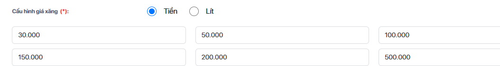

---
type: srs
feature: thong-ke-san-pham-ban-chay
status: draft
lang: vi
owner: "@huelinh"
created: 2026-07-22
updated: 2026-07-22
version: "1.0"
priority: P1
links: []
tags: [report, best-seller, filter, category, xang-dau]
stale_reason: ""
changelog:
  - 2026-07-22 | /srs | tra DB thật: chốt điều kiện xăng dầu (config value=4) + nhóm SP (product_group/product_product_group); resolve OQ-04, giảm OQ-02
  - 2026-07-22 | /srs | initial draft — bỏ giới hạn xếp hạng + option Không giới hạn, chặn xăng dầu, thêm lọc Nhóm sản phẩm
---

# Tài liệu SRS — Thống kê sản phẩm bán chạy (thay đổi bộ lọc xếp hạng & nhóm sản phẩm)

**Mã tài liệu:** SRS-BEST-SELLER-001
**Phiên bản:** 1.0
**Ngày tạo:** 22/07/2026
**Người soạn:** @huelinh (Duong Thi Hue Linh)
**Trạng thái:** Draft

---

## LỊCH SỬ THAY ĐỔI TÀI LIỆU

> *A – Tạo mới, M – Sửa đổi, D – Xóa bỏ*

| Ngày thay đổi | Vị trí thay đổi | A / M / D | Nguồn gốc | Đầu mối | Mô tả thay đổi | Ghi chú |
|--------------|----------------|-----------|-----------|---------|----------------|---------|
| 22/07/2026 | Toàn bộ | A | Phản hồi khách hàng | @huelinh | Tạo mới tài liệu thay đổi | Kế thừa nghiệp vụ gốc "Thống kê sản phẩm bán chạy" (09/08/2025, Nguyễn Thị Minh Ánh) |

---

## MỤC LỤC

1. Nguồn gốc thay đổi
2. Nội dung thay đổi
   - 2.1 Mô tả chung về yêu cầu thay đổi
   - 2.2 Mô tả thay đổi về luồng nghiệp vụ
   - 2.3 Yêu cầu người dùng
   - 2.4 Ngữ cảnh người dùng
   - 2.5 Mô tả thay đổi về CSDL
   - 2.6 Danh sách các chức năng
3. Chi tiết các chức năng thay đổi
4. Chi tiết các nghiệp vụ ảnh hưởng
5. Open Questions

---

## 1. NGUỒN GỐC THAY ĐỔI

Khách phản ánh báo cáo đang **khóa top 20 sản phẩm**, không đủ dùng cho doanh nghiệp nhiều mặt hàng (**≥ 1.000 mặt hàng**). Yêu cầu: (1) bỏ giới hạn số dòng xếp hạng — cho nhập tự do + tùy chọn "Không giới hạn", trần do BU quyết định; (2) thêm lọc theo nhóm sản phẩm. Ràng buộc nội bộ: loại hình **Xăng dầu không dùng "Không giới hạn"**.

---

## 2. NỘI DUNG THAY ĐỔI

### 2.1 Mô tả chung về yêu cầu thay đổi

Thay đổi chỉ ở **bộ lọc tham số**, không đổi công thức tính của bản gốc:

- **Xếp hạng**: từ ô chọn cố định 5/10/15/20 → **combobox nhập số tự do** + tùy chọn **"Không giới hạn"**.
- **Xăng dầu**: không có "Không giới hạn", chỉ nhập số ≤ trần.
- Thêm bộ lọc **Nhóm sản phẩm** để xếp hạng theo từng ngành hàng.

### 2.2 Mô tả thay đổi về luồng nghiệp vụ

**As-Is:** chọn tham số → Xếp hạng khóa top 20 → hệ thống lấy top-N trên **toàn bộ** mặt hàng, không lọc theo nhóm.

**To-Be:** thêm chọn **Nhóm sản phẩm** và nhập số / "Không giới hạn" → hệ thống **lọc theo nhóm trước**, rồi xếp hạng lấy top-N (hoặc toàn bộ nếu "Không giới hạn"; Xăng dầu không có tùy chọn này).

### 2.3 Yêu cầu người dùng

| # | Đối tượng | Nhu cầu | Mục đích |
|---|-----------|---------|----------|
| 1 | Chủ / Quản lý DN nhiều mặt hàng | Tự nhập số dòng xếp hạng hoặc xem "Không giới hạn" | Không bị khóa ở top 20, xem đủ mặt hàng cần phân tích |
| 2 | Chủ / Quản lý / Kế toán | Lọc theo nhóm sản phẩm | So sánh, phân tích theo từng ngành hàng thay vì gộp toàn bộ |
| 3 | Người dùng ngành Xăng dầu | Chặn tùy chọn "Không giới hạn" | Tránh xuất báo cáo quá tải, phù hợp đặc thù ngành |

### 2.4 Ngữ cảnh người dùng

Đối tượng sử dụng chính là chủ cửa hàng, quản lý chi nhánh, kế toán — tra cứu định kỳ (cuối ngày/cuối kỳ) trên máy tính. Áp dụng cho các doanh nghiệp bán lẻ đa mặt hàng (mỹ phẩm, quần áo, gia dụng…) có nhu cầu phân tích theo nhóm ngành hàng; riêng loại hình Xăng dầu có ràng buộc đặc thù.

### 2.5 Mô tả thay đổi về CSDL

Không phát sinh bảng/cột mới. Bộ lọc mới sử dụng dữ liệu sẵn có:

| Loại thay đổi | Bảng | Cột | Mô tả |
|:---:|------|-----|-------|
| — | `config` | `company_id`, `code`, `value` | Đọc bản ghi `code='business_type'`; `value='4'` = Xăng dầu → chặn "Không giới hạn" (BR-05) |
| — | `product_group` | `id`, `com_id`, `name`, `parent_id`, `path` | Danh mục nhóm sản phẩm (có phân cấp cha/con) cho bộ lọc **Nhóm sản phẩm** |
| — | `product_product_group` | `product_id`, `product_group_id` | Bảng nối N-N sản phẩm ↔ nhóm; dùng để lọc/loại sản phẩm theo nhóm (BR-06) |

*(Không có thay đổi cấu trúc CSDL — chỉ đọc dữ liệu hiện có.)*

### 2.6 Danh sách các chức năng

| Actor | Màn hình | Chức năng | Mô tả | Độ ưu tiên |
|-------|---------|-----------|-------|-----------|
| Chủ/Quản lý/Kế toán | Thống kê sản phẩm bán chạy | Lọc & xếp hạng linh hoạt | Nhập số xếp hạng tự do hoặc "Không giới hạn"; chặn "Không giới hạn" cho Xăng dầu | Cao |
| Chủ/Quản lý/Kế toán | Thống kê sản phẩm bán chạy | Lọc theo Nhóm sản phẩm | Giới hạn danh sách sản phẩm được xếp hạng theo nhóm ngành hàng | Cao |

---

## 3. CHI TIẾT CÁC CHỨC NĂNG THAY ĐỔI

### 3.1 Bộ lọc tham số "Thống kê sản phẩm bán chạy"

#### 3.1.1 Thông tin chung về chức năng

Chức năng cho phép người dùng cấu hình tham số trước khi xem báo cáo top sản phẩm bán chạy. So với bản gốc, bổ sung **ô nhập số xếp hạng linh hoạt** (kèm tùy chọn "Không giới hạn", có ràng buộc theo loại hình kinh doanh) và **bộ lọc Nhóm sản phẩm**. Các trường còn lại (Chi nhánh, Kỳ báo cáo, Từ – đến ngày, Sắp xếp theo, Tách doanh thu Combo) giữ nguyên nghiệp vụ gốc.

#### 3.1.2 Màn hình chức năng

Bộ lọc tham số hiển thị dạng popup/panel gồm các trường sau (đánh dấu **[MỚI]** / **[SỬA]** cho phần thay đổi):

| # | Thành phần | Loại | Bắt buộc | Mô tả |
|---|-----------|------|---------|-------|
| 1 | Chi nhánh | Combobox | Có | Giữ nguyên. Danh sách chi nhánh được phép truy cập; mặc định chi nhánh đang truy cập; chọn 1 |
| 2 | Kỳ báo cáo | Combobox | Có | Giữ nguyên. Giá trị: hôm nay, hôm qua, tuần này, tuần trước, tháng này, tháng trước, 30 ngày qua, quý này, quý trước, năm nay, năm trước, tháng 1–12, tùy chỉnh. Mặc định **tháng này** |
| 3 | Từ ngày – đến ngày | Datepicker | Có | Giữ nguyên. Fill theo kỳ báo cáo, cho sửa lại. Điều kiện: Đến ngày ≥ Từ ngày; Từ ngày ≤ ngày hiện tại |
| 4 | **Nhóm sản phẩm** **[MỚI]** | Combobox | Không | Lọc danh sách sản phẩm theo nhóm ngành hàng. Giá trị: **Tất cả nhóm** (mặc định), **Chưa có nhóm**, và danh sách nhóm sản phẩm của công ty (VD: mỹ phẩm, quần áo, gia dụng). Chọn 1 *(chọn nhiều — xem OQ-05)* |
| 5 | **Xếp hạng** **[SỬA]** | Combobox nhập số (editable) | Có | Cho **nhập số lượng nguyên dương** trực tiếp; chọn nhanh **5 / 10 / 15 / 20**; tùy chọn **"Không giới hạn"**. Mặc định **20** *(giữ 10 hay đổi 20 — xem OQ-03)*. Validation: xem Mục 3.1.3. Ràng buộc Xăng dầu: xem BR-05 |
| 6 | Sắp xếp theo | Combobox | Có | Giữ nguyên. Giá trị: **Doanh thu giảm dần**, **Số lượng bán giảm dần** |
| 7 | Tách doanh thu Combo theo từng thành phần | Checkbox | Không | Giữ nguyên nghiệp vụ gốc. Mặc định **tắt** (xem BR-07) |

Nút: **Thoát** (đóng, trở về màn trước) · **Xem báo cáo** (áp tham số, tải dữ liệu).

**Chi tiết combobox "Xếp hạng":**

- Ô nhập cho gõ số; bên phải có mũi tên mở danh sách chọn nhanh: `5`, `10`, `15`, `20`, và dòng **"Không giới hạn"** (tách riêng dưới đường kẻ).
- Chọn một giá trị nhanh → điền vào ô. Gõ số trùng giá trị nhanh → tự đánh dấu dòng tương ứng.
- Chọn **"Không giới hạn"** → ô hiển thị nhãn "Không giới hạn"; báo cáo lấy toàn bộ sản phẩm thỏa điều kiện.
- Với loại hình **Xăng dầu**: dòng "Không giới hạn" **không hiển thị** trong danh sách; người dùng chỉ nhập số ≤ trần (BR-05).

#### 3.1.3 Xử lý luồng sự kiện tương tác

| Bước | Hành động người dùng | Phản hồi hệ thống | Điều kiện |
|------|---------------------|------------------|-----------|
| 1 | Mở bộ lọc | Hiển thị tham số mặc định; ô Xếp hạng = 20, Nhóm sản phẩm = "Tất cả nhóm" | — |
| 2 | Gõ số vào ô Xếp hạng | Chỉ nhận ký tự số (lọc bỏ chữ/ký tự); đồng bộ đánh dấu giá trị nhanh nếu trùng | — |
| 3 | Bấm mũi tên / mở danh sách | Hiển thị 5/10/15/20 + "Không giới hạn" (ẩn "Không giới hạn" nếu là Xăng dầu) | — |
| 4 | Chọn "Không giới hạn" | Ô hiển thị "Không giới hạn"; ẩn hậu tố số | Loại hình ≠ Xăng dầu |
| 5 | Bấm Enter trong ô Xếp hạng | Chốt giá trị, đóng danh sách chọn nhanh | Giá trị hợp lệ |
| 6 | Chọn Nhóm sản phẩm | Ghi nhận nhóm để lọc DS sản phẩm khi xem báo cáo | — |
| 7 | Bấm **Xem báo cáo** | Lọc theo Nhóm sản phẩm → xếp hạng theo Sắp xếp → lấy top-N (hoặc toàn bộ nếu "Không giới hạn") | Tham số hợp lệ |

**Trường hợp lỗi / Ngoại lệ:**

| Tình huống | Thông báo / Hành vi | Hành động hệ thống |
|-----------|--------------------|-------------------|
| Xếp hạng để trống / = 0 / số âm | Cảnh báo "Nhập số nguyên từ 1 trở lên" (viền đỏ) | Chặn Xem báo cáo |
| Xếp hạng nhập số thập phân / chữ | Tự lọc, chỉ giữ số nguyên | Không cho ký tự không hợp lệ |
| Xếp hạng vượt trần BU quy định | Cảnh báo "Tối đa {trần} sản phẩm" | Chặn Xem báo cáo (xem OQ-01) |
| Xăng dầu chọn/nhập "Không giới hạn" | Không có tùy chọn này để chọn | Ẩn khỏi danh sách (BR-05) |
| Nhóm sản phẩm không có sản phẩm bán trong kỳ | Hiển thị bảng rỗng "Không có dữ liệu" | Không hiển thị dòng nào |

#### 3.1.4 Xử lý luồng sự kiện hệ thống

**a) Nhận diện loại hình kinh doanh (chặn "Không giới hạn" cho Xăng dầu)**

Khi mở bộ lọc, hệ thống đọc cấu hình loại hình kinh doanh của công ty đang truy cập từ bảng `config`: bản ghi có `code = 'business_type'`, cột `value` chứa mã loại hình (`0` F&B, `1` Hotel, `2` Karaoke, `3` Khác, `4` Xăng dầu — PETROLIMEX/GAS).

Điều kiện xác định Xăng dầu:

```sql
-- Công ty hiện tại là Xăng dầu khi:
SELECT CASE WHEN EXISTS (
    SELECT 1 FROM config
    WHERE company_id = @company_id      -- công ty đang truy cập
      AND code = 'business_type'
      AND value = N'4'                  -- 4 = Xăng dầu (PETROLIMEX/GAS)
) THEN 1 ELSE 0 END AS is_petrol;
```

- `is_petrol = 1` → **ẩn tùy chọn "Không giới hạn"** trong combobox Xếp hạng; ô Xếp hạng bắt buộc nhập số ≤ trần (BR-05).
- `is_petrol = 0` → hiển thị đầy đủ, gồm "Không giới hạn".

**b) Lọc theo Nhóm sản phẩm rồi xếp hạng (top-N)**

Nhóm sản phẩm lưu ở bảng `product_group` (`id`, `com_id`, `name`, `parent_id`, `path` — có phân cấp cha/con); quan hệ sản phẩm ↔ nhóm là N-N qua bảng nối `product_product_group` (`product_id`, `product_group_id`).

**Ý nghĩa:** chọn một nhóm cụ thể = lấy **tất cả sản phẩm thuộc nhóm đó (và các nhóm con)** làm tập dữ liệu, sau đó sắp xếp theo tiêu chí và áp Xếp hạng trên chính tập này (top-N trong nhóm, hoặc toàn bộ nếu "Không giới hạn"). Khi Xem báo cáo, hệ thống áp điều kiện lọc **trước** khi tổng hợp và xếp hạng:

| Lựa chọn Nhóm sản phẩm | Điều kiện lọc sản phẩm |
|------------------------|------------------------|
| **Tất cả nhóm** (mặc định) | Không áp điều kiện nhóm |
| **Nhóm cụ thể** `@group_id` | `EXISTS (SELECT 1 FROM product_product_group ppg WHERE ppg.product_id = p.id AND ppg.product_group_id IN (@group_id + các nhóm con))` |
| **Chưa có nhóm** | `NOT EXISTS (SELECT 1 FROM product_product_group ppg WHERE ppg.product_id = p.id)` |

Lấy cả nhóm con của `@group_id` (do nhóm có phân cấp) qua `product_group.path`:

```sql
-- Danh sách id nhóm gồm nhóm đã chọn và toàn bộ nhóm con:
SELECT id FROM product_group
WHERE com_id = @com_id
  AND (id = @group_id OR path LIKE (
        SELECT path FROM product_group WHERE id = @group_id
      ) + '%');
```

Sau khi lọc, hệ thống tổng hợp Số lượng bán / Doanh thu theo sản phẩm (BR-01, BR-08), sắp xếp theo tiêu chí "Sắp xếp theo", rồi:
- Xếp hạng có số N → lấy `TOP (@N)`.
- "Không giới hạn" → lấy **toàn bộ** sản phẩm thỏa điều kiện (không `TOP`).

#### 3.1.5 Quy tắc nghiệp vụ

| Mã | Nội dung |
|----|----------|
| BR-best-seller-001 | **Nguồn dữ liệu:** `product`, `product_product_unit`, `bill_product`. Chỉ lấy đơn hàng trạng thái hợp lệ (BR-03) và dòng `bill_product.feature` ∈ {1, 2, 5} (feature = 2 lấy doanh thu tiền = 0) |
| BR-best-seller-002 | `bill.status`: 0 chưa hoàn thành, 1 hoàn thành, 2 hủy, 3 bị trả hàng, 4 trả hàng, 5 bị thay thế, 6 thay thế, 7 gộp, 8 tách |
| BR-best-seller-003 | **Tổng doanh thu** tính theo công thức dấu **`1 + 3 − 4 + 6`** (hoàn thành + bị trả hàng − trả hàng + thay thế); status 4 mang giá trị âm |
| BR-best-seller-004 | **Xếp hạng (top-N):** cho nhập **số nguyên ≥ 1**. Chọn nhanh 5/10/15/20. Chặn rỗng/0/âm/thập phân. Mặc định 20 (xem OQ-03). Trần tối đa do BU quy định (xem OQ-01) |
| BR-best-seller-005 | **"Không giới hạn":** hiển thị toàn bộ sản phẩm thỏa điều kiện, không cắt ngọn. **Không áp dụng cho loại hình Xăng dầu** — công ty là Xăng dầu khi tồn tại bản ghi `config(company_id, code='business_type', value=N'4')`; khi đó ẩn tùy chọn "Không giới hạn" và bắt buộc nhập số ≤ trần (xem 3.1.4.a, OQ-01) |
| BR-best-seller-006 | **Nhóm sản phẩm** (dùng `product_group` + bảng nối `product_product_group`, lọc **trước** khi xếp hạng): "Tất cả nhóm" = không lọc; **nhóm cụ thể = lấy tất cả sản phẩm thuộc nhóm đó và các nhóm con** (`product_group_id` khớp theo `product_group.path`) làm tập dữ liệu rồi sắp xếp + xếp hạng trên tập đó; "Chưa có nhóm" = sản phẩm không có bản ghi nào trong `product_product_group` (xem 3.1.4.b) |
| BR-best-seller-007 | **Tách doanh thu Combo** (giữ nguyên gốc): Bật → tính tách combo theo từng thành phần, DS không hiển thị sản phẩm combo; nếu người dùng chọn sản phẩm combo thì tự bỏ tích, bỏ qua combo. Tắt → tính doanh thu combo riêng biệt |
| BR-best-seller-008 | **Sắp xếp:** "Số lượng bán giảm dần" = theo tổng `sum(bill_product.quantity)`; "Doanh thu giảm dần" = theo `sum(bill_product.total_amount) − sum(bill_product.discount_allocated)` |

#### 3.1.6 Cột dữ liệu báo cáo (giữ nguyên gốc — tham chiếu)

| STT | Cột | Nguồn / Công thức |
|-----|-----|-------------------|
| 1 | STT | Đánh theo thứ tự |
| 2 | Mã SP | `product.code` |
| 3 | Tên SP | `product_product_unit.product_name` |
| 4 | ĐVT | `product_product_unit.unit_name` |
| 5 | Số lượng bán | `sum(bill_product.quantity)` |
| 6 | Doanh thu | `sum(bill_product.total_amount) − sum(bill_product.discount_allocated)` |

---

## 4. CHI TIẾT CÁC NGHIỆP VỤ ẢNH HƯỞNG

### 4.1 Các nghiệp vụ trong cùng hệ thống

| Chức năng bị ảnh hưởng | Màn hình | Mức độ ảnh hưởng | Mô tả ảnh hưởng |
|------------------------|---------|-----------------|----------------|
| Biểu đồ Top sản phẩm bán chạy | Thống kê sản phẩm bán chạy (biểu đồ cột) | Cao | Trục X (top DS sản phẩm) phải áp cùng số Xếp hạng + Nhóm sản phẩm đã chọn. Khi "Không giới hạn", cần xác định cách hiển thị biểu đồ cho số lượng lớn (xem OQ-06) |
| Kết xuất Excel / PDF | Thống kê sản phẩm bán chạy | Trung bình | File xuất theo bộ lọc hiện tại; khi "Không giới hạn" số dòng có thể rất lớn, ảnh hưởng dung lượng/thời gian xuất |
| Top nhân viên bán tốt | Báo cáo top nhân viên | Thấp | Cùng dùng bộ lọc Top (5/10/15/20). Cần xác nhận có áp cùng thay đổi "nhập tự do / Không giới hạn" hay giữ nguyên (xem OQ-07) |

### 4.2 Chức năng của hệ thống khác

Không áp dụng.

---

## 5. OPEN QUESTIONS

| # | Câu hỏi | Ảnh hưởng đến mục | Người cần trả lời | Trạng thái |
|---|---------|------------------|------------------|-----------|
| OQ-01 | **Trần tối đa** cho ô Xếp hạng do BU quyết định là bao nhiêu (VD 500/1000/không trần)? Áp cho cả loại hình thường lẫn xăng dầu hay khác nhau? | 3.1.2, 3.1.3, BR-04, BR-05 | BU / Nguyễn Thị Minh Ánh | [ ] |
| OQ-02 | Với **Xăng dầu**: ẩn hẳn tùy chọn "Không giới hạn" hay disable + tooltip giải thích? Ô nhập số tự do có bị giới hạn trần riêng khác loại hình thường không? | 3.1.2, 3.1.4, BR-05 | BU | [~] Cách nhận diện đã chốt: `config.code='business_type'` & `value='4'` = Xăng dầu. Còn lại: ẩn hẳn hay disable — chờ BU |
| OQ-03 | Giá trị **mặc định** ô Xếp hạng giữ **10** (theo bản gốc) hay đổi **20** (theo UI mới)? | 3.1.2, BR-04 | Nguyễn Thị Minh Ánh | [ ] |
| OQ-04 | Nguồn **nhóm sản phẩm**: trường/bảng nào? "Chưa có nhóm" xác định bằng điều kiện gì? | 2.5, 3.1.2, BR-06 | Dev / BA | [x] Đã chốt: `product_group` + bảng nối `product_product_group`; "Chưa có nhóm" = `NOT EXISTS` bản ghi trong `product_product_group` (xem 3.1.4.b) |
| OQ-05 | Bộ lọc **Nhóm sản phẩm** cho **chọn 1** hay **chọn nhiều** nhóm? | 3.1.2, BR-06 | Nguyễn Thị Minh Ánh | [ ] |
| OQ-06 | Khi chọn **"Không giới hạn"**, **biểu đồ cột** hiển thị thế nào cho số lượng sản phẩm lớn (giới hạn số cột hiển thị / phân trang / chỉ hiển thị top biểu đồ)? | 4.1 | Nguyễn Thị Minh Ánh | [ ] |
| OQ-07 | Báo cáo **Top nhân viên bán tốt** có áp cùng thay đổi (nhập tự do / Không giới hạn / chặn xăng dầu) hay giữ nguyên 5-10-15-20? | 4.1 | Nguyễn Thị Minh Ánh | [ ] |
