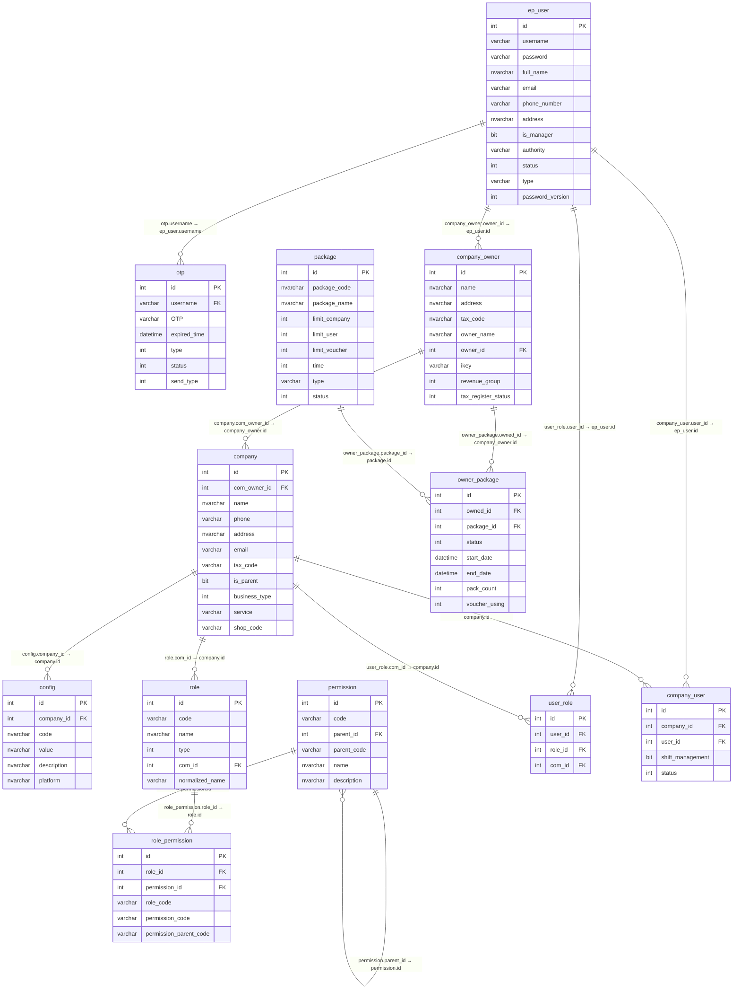

# ERD — Account Service Database

> Schema: `dbo` | Database: `accountdb` (sau khi tách từ `easyposbackoffice`)

## Sơ đồ quan hệ

---

## Chú thích quan hệ

| Quan hệ | Loại | Ghi chú |
|---|---|---|
| `ep_user` → `otp` | Soft ref by string | `otp.username = ep_user.username`, không phải ID |
| `ep_user` → `company_owner` | FK nội bộ | `company_owner.owner_id = ep_user.id` |
| `ep_user` → `user_role` | FK nội bộ | `user_role.user_id = ep_user.id` |
| `ep_user` → `company_user` | FK nội bộ | `company_user.user_id = ep_user.id` |
| `company_owner` → `company` | FK nội bộ | `company.com_owner_id = company_owner.id` |
| `company_owner` → `owner_package` | FK nội bộ | `owner_package.owned_id = company_owner.id` |
| `package` → `owner_package` | FK nội bộ | `owner_package.package_id = package.id` |
| `company` → `config` | FK nội bộ | `config.company_id = company.id` |
| `company` → `role` | FK nội bộ | `role.com_id = company.id` — **trước đây là soft ref** |
| `company` → `user_role` | FK nội bộ | `user_role.com_id = company.id` — **trước đây là soft ref** |
| `company` → `company_user` | FK nội bộ | `company_user.company_id = company.id` — **trước đây là soft ref** |
| `role` → `role_permission` | FK nội bộ | `role_permission.role_id = role.id` |
| `permission` → `role_permission` | FK nội bộ | `role_permission.permission_id = permission.id` |
| `permission` → `permission` | Self-ref | `permission.parent_id = permission.id` (cây phân quyền) |

---

## Lưu ý: schema trans_hub

Database hiện tại có schema `trans_hub` chứa bản sao của `role`, `permission`, `role_permission` với cấu trúc tương tự nhưng khác tên cột (`created_by`/`updated_by` thay vì `creator`/`updater`).

`trans_hub.*` **không thuộc Account Service này** — là RBAC riêng của TransHub service. Khi tách database, cần làm rõ `trans_hub.*` đi về database nào.

---

## Cột audit (bỏ khỏi ERD cho gọn)

Mọi bảng đều có 4 cột audit chuẩn, không vẽ vào sơ đồ:

| Cột | Kiểu | Ý nghĩa |
|---|---|---|
| `creator` | int | ID người tạo (soft ref → ep_user.id) |
| `updater` | int | ID người cập nhật cuối (soft ref → ep_user.id) |
| `create_time` | datetime | Thời gian tạo |
| `update_time` | datetime | Thời gian cập nhật cuối |
